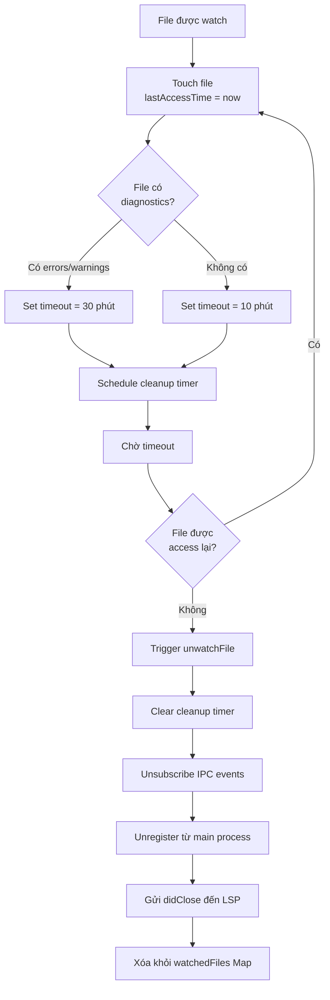
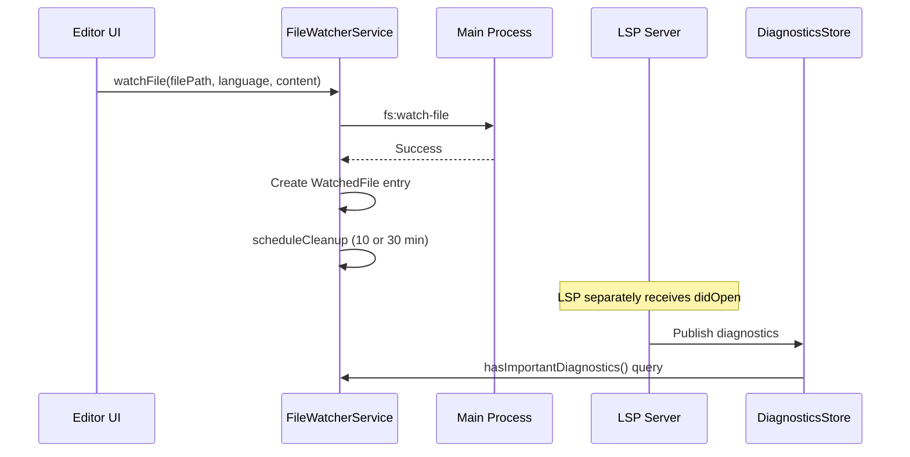
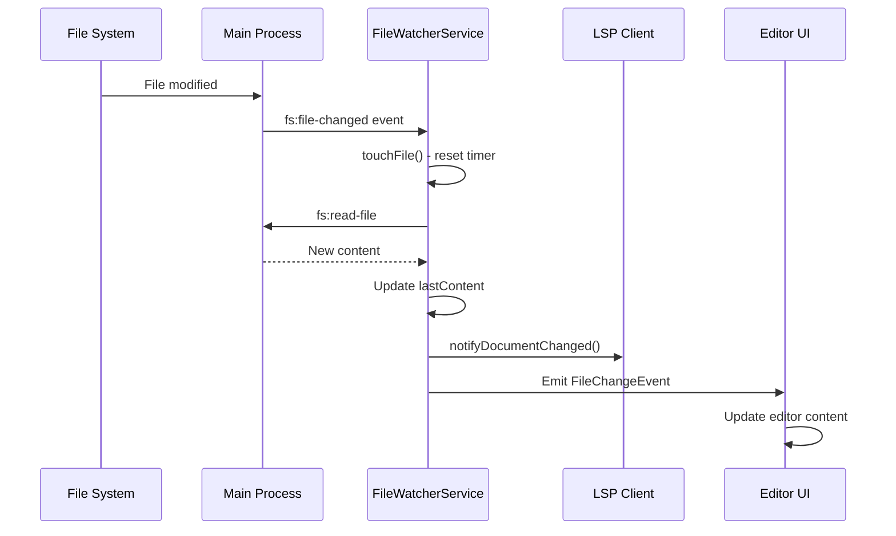
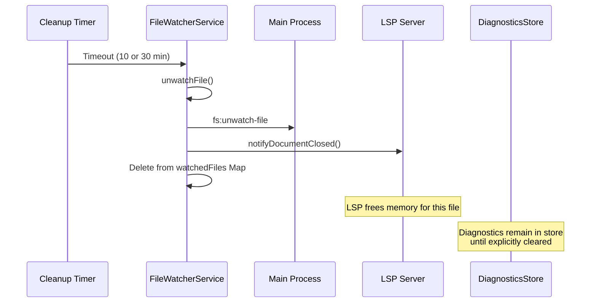

# File Watcher & Diagnostics Cleanup System - V2 (Optimized)

## Overview

Đây là tài liệu mô tả hệ thống quản lý File Watcher và tự động dọn dẹp Diagnostics trong Phantoma Code Editor phiên bản tối ưu (V2). Hệ thống đã được refactor để giải quyết các vấn đề của phiên bản cũ và cải thiện hiệu năng đáng kể.

## Key Improvements from V1

### 1. ✅ Sweep Interval thay vì Per-File Timers
- **Trước:** Mỗi file có 1 `setTimeout` riêng → N timers trong memory
- **Sau:** 1 `setInterval` duy nhất quét toàn bộ mỗi 60s → 1 timer
- **Lợi ích:** 
  - Timeout được đánh giá động → tự động phản ứng với diagnostics changes
  - `touchFile()` chỉ update timestamp, không reschedule → rẻ hơn nhiều
  - Giảm memory footprint khi có nhiều file

### 2. ✅ Smart Cleanup Guards
- **Active file guard:** File đang focus sẽ KHÔNG BAO GIỜ bị cleanup
- **Dirty file guard:** File có unsaved changes sẽ KHÔNG BAO GIỜ bị cleanup
- **Lợi ích:** Tránh đóng LSP session của file user đang làm việc

### 3. ✅ LRU Eviction với Max Capacity
- **Hard limit:** Tối đa 150 files được watch cùng lúc
- **LRU eviction:** Khi vượt trần, xóa file cũ nhất (bỏ qua active/dirty)
- **Lợi ích:** Bảo vệ memory khi thao tác hàng loạt (find & replace, global search)

### 4. ✅ Content Hash thay vì Full String Comparison
- **Trước:** So sánh `lastContent === newContent` (toàn bộ string)
- **Sau:** So sánh hash: `${length}:${first100}:${last100}`
- **Lợi ích:** Nhanh hơn nhiều với file lớn, giảm CPU

### 5. ✅ LSP Reconnection Resync
- Lắng nghe event `lsp:reconnected`
- Tự động replay `didOpen` cho tất cả watched files
- Throttle 50ms giữa các notifications để tránh flood
- **Lợi ích:** LSP luôn sync với editor sau crash/restart

### 6. ✅ Immediate File Deletion Handling
- Lắng nghe event `fs:file-deleted`
- Cleanup ngay lập tức thay vì chờ timeout
- **Lợi ích:** Giải phóng tài nguyên sớm, tránh UI sai

## Architecture Components

### 1. File Watcher Service
**Location:** `src/renderer/src/modules/Code/services/file-watcher.service.ts`

#### Responsibilities
- Theo dõi file changes từ hệ thống
- Giữ watchers hoạt động ngay cả khi file tabs bị đóng
- Thông báo LSP server về external changes
- Phát sự kiện để cập nhật UI
- Tự động dọn dẹp các file không hoạt động

#### Key Data Structures

```typescript
interface WatchedFile {
  filePath: string;              // Đường dẫn tuyệt đối của file
  language: string;              // Ngôn ngữ (typescript, javascript, python, etc.)
  unsubscribe: () => void;       // Hàm để hủy đăng ký IPC listener
  lastContent: string;           // Nội dung cuối cùng được biết
  lastAccessTime: number;        // Timestamp lần access cuối (ms)
  contentHash: string;           // Hash để so sánh nhanh thay vì full string
}
```

**Notable Changes from V1:**
- ❌ Removed: `cleanupTimer?: NodeJS.Timeout` (không cần nữa, dùng sweep interval)
- ✅ Added: `contentHash: string` (để so sánh nhanh)

### 2. Diagnostics Store
**Location:** `src/renderer/src/modules/Code/stores/diagnosticsStore.ts`

#### Responsibilities
- Lưu trữ diagnostics (errors, warnings, infos, hints) từ LSP
- Tính toán statistics theo file
- Cache statistics để tối ưu performance
- Cung cấp API để truy vấn diagnostics

#### Key Data Structures

```typescript
interface Diagnostic {
  uri: string;                   // file:///path/to/file.ts
  severity: 1 | 2 | 3 | 4;      // 1=Error, 2=Warning, 3=Info, 4=Hint
  message: string;               // Mô tả lỗi
  source?: string;               // Nguồn (typescript, eslint, etc.)
  range: {
    start: { line: number; character: number };
    end: { line: number; character: number };
  };
  code?: string | number;        // Mã lỗi
  relatedInformation?: any[];    // Thông tin liên quan
}

interface FileDiagnosticStats {
  errors: number;    // Số lượng errors
  warnings: number;  // Số lượng warnings
  infos: number;     // Số lượng infos
  hints: number;     // Số lượng hints
  total: number;     // Tổng số diagnostics
}
```

### 3. LSP Client Service
**Location:** `src/renderer/src/modules/Code/services/lsp-client.service.ts`

#### Responsibilities
- Quản lý kết nối với các Language Servers
- Cung cấp language features (completion, hover, definition, etc.)
- Nhận và xử lý diagnostics từ LSP servers
- Thông báo document lifecycle (open, change, save, close)

#### LSP Document Notifications
```typescript
// Khi document được mở
notifyDocumentOpened(language, uri, languageId, text, version)

// Khi document thay đổi (có debounce 500ms)
notifyDocumentChanged(language, uri, text, version)

// Khi document được save
notifyDocumentSaved(language, uri, text)

// Khi document được đóng (cleanup LSP memory)
notifyDocumentClosed(language, uri)
```

## Cleanup Strategy

### Timeout Configuration

```typescript
// Cleanup configuration
const INACTIVE_TIMEOUT = 10 * 60 * 1000;           // 10 phút
const WITH_DIAGNOSTICS_TIMEOUT = 30 * 60 * 1000;   // 30 phút
```

### Cleanup Logic Flow



### Key Methods

#### 1. `scheduleCleanup(filePath: string)`
Lên lịch cleanup cho một file:

```typescript
private scheduleCleanup(filePath: string) {
  const watched = this.watchedFiles.get(filePath);
  if (!watched) return;

  // Clear existing timer
  if (watched.cleanupTimer) {
    clearTimeout(watched.cleanupTimer);
  }

  // Determine timeout based on diagnostics
  const hasDiagnostics = this.hasImportantDiagnostics(filePath);
  const timeout = hasDiagnostics ? WITH_DIAGNOSTICS_TIMEOUT : INACTIVE_TIMEOUT;

  watched.cleanupTimer = setTimeout(() => {
    this.unwatchFile(filePath);
  }, timeout);
}
```

**Logic:**
1. Xóa timer cũ nếu có
2. Kiểm tra file có diagnostics quan trọng (errors/warnings) không
3. Chọn timeout phù hợp:
   - **30 phút** nếu có diagnostics
   - **10 phút** nếu không có diagnostics
4. Đặt timer mới để gọi `unwatchFile()`

#### 2. `hasImportantDiagnostics(filePath: string): boolean`
Kiểm tra file có diagnostics quan trọng:

```typescript
private hasImportantDiagnostics(filePath: string): boolean {
  const stats = useDiagnosticsStore.getState().getStatsForFile(filePath);
  return stats.errors > 0 || stats.warnings > 0;
}
```

**Note:** Chỉ coi errors và warnings là "important", không tính infos và hints.

#### 3. `touchFile(filePath: string)`
Reset cleanup timer khi file được access:

```typescript
touchFile(filePath: string) {
  const watched = this.watchedFiles.get(filePath);
  if (!watched) return;

  watched.lastAccessTime = Date.now();
  this.scheduleCleanup(filePath);  // Reset timer
}
```

**Được gọi khi:**
- File được mở
- File được edit
- File nhận external change
- File được view

#### 4. `unwatchFile(filePath: string)`
Dừng theo dõi và cleanup một file:

```typescript
async unwatchFile(filePath: string) {
  const watched = this.watchedFiles.get(filePath);
  if (!watched) return;

  // Clear cleanup timer
  if (watched.cleanupTimer) {
    clearTimeout(watched.cleanupTimer);
  }

  // Unsubscribe from IPC events
  watched.unsubscribe();

  // Unregister from main process
  try {
    await window.api.invoke('fs:unwatch-file', filePath);
  } catch (err) {
    console.error('[FileWatcherService] ❌ Error unwatching:', err);
  }

  // Send didClose to LSP server to free memory
  const uri = `file://${filePath}`;
  try {
    await lspClientManager.notifyDocumentClosed(watched.language, uri);
  } catch (err) {
    console.error('[FileWatcherService] ❌ Error sending didClose:', err);
  }
  
  this.watchedFiles.delete(filePath);
}
```

**Cleanup Steps:**
1. Xóa cleanup timer
2. Hủy đăng ký IPC event listener
3. Thông báo main process ngừng watch file
4. **Gửi `didClose` notification đến LSP server** (quan trọng để LSP giải phóng memory)
5. Xóa file khỏi Map

## Integration Flow

### When File is Opened



### When File Changes Externally



### When Cleanup Timer Expires



## Performance Considerations

### Memory Management

1. **File Watchers**: Mỗi file trong `watchedFiles` Map chiếm:
   - File path string
   - Language string
   - Last content string (có thể lớn)
   - Timestamp number
   - Timer reference
   - IPC unsubscribe function

2. **Diagnostics Store**: 
   - Lưu diagnostics theo URI format
   - Cache statistics chỉ cho files có errors/warnings
   - Statistics được rebuild khi diagnostics thay đổi

3. **LSP Memory**: 
   - LSP server giữ document trong memory cho mỗi open file
   - `didClose` notification giúp LSP giải phóng memory
   - Không gửi `didClose` → memory leak trong LSP server

### Debouncing

1. **Document Changes**: LSP changes được debounce 500ms
   ```typescript
   const OPTIMIZED_DEBOUNCE_DELAY = 500;
   ```

2. **File Watching**: Không có debounce, xử lý ngay khi có change event

### Caching Strategy

1. **Diagnostics Stats Cache**:
   ```typescript
   _statsCache: Map<string, FileDiagnosticStats>
   ```
   - Chỉ cache files có errors/warnings
   - Rebuild khi diagnostics thay đổi
   - Trả về cùng Map reference để tránh infinite re-renders

## Edge Cases & Handling

### Case 1: File được mở lại trước khi cleanup
**Scenario:** User mở file, đóng tab, rồi mở lại trong vòng 10 phút.

**Handling:**
```typescript
async watchFile(filePath: string, language: string, initialContent: string) {
  // Already watching this file - just touch it
  if (this.watchedFiles.has(filePath)) {
    this.touchFile(filePath);  // Reset timer
    return;
  }
  // ... create new watcher
}
```
→ Không tạo watcher mới, chỉ reset timer.

### Case 2: File có diagnostics mới trong lúc chờ cleanup
**Scenario:** File không có lỗi (timeout 10 min), sau 5 phút có lỗi mới.

**Handling:**
- `scheduleCleanup()` được gọi lại khi diagnostics thay đổi? **Không tự động**
- Timer vẫn giữ nguyên 10 phút từ lần touch cuối
- **Potential issue:** File có thể bị cleanup dù có lỗi mới

**Suggested improvement:** Listen to diagnostics changes và reschedule cleanup.

### Case 3: LSP server chết/restart
**Scenario:** LSP server crash hoặc được restart.

**Handling:**
- File watchers vẫn hoạt động (độc lập với LSP)
- `notifyDocumentClosed()` có thể fail silently
- LSP mới sẽ không biết về open documents

**Suggested improvement:** Re-notify LSP về all watched files sau khi reconnect.

### Case 4: Multiple rapid changes
**Scenario:** File được edit liên tục (e.g., formatting, bulk replace).

**Handling:**
- Mỗi change gọi `touchFile()` → reset timer
- LSP changes được debounce 500ms → giảm tải
- External changes không debounce → mọi change đều process

### Case 5: File bị xóa khỏi disk
**Scenario:** File đang được watch bị user xóa từ ngoài editor.

**Handling:**
- Main process sẽ detect file deletion
- IPC event `fs:file-changed` có thể bị lỗi khi read file
- Error được log nhưng watcher vẫn tồn tại
- Cleanup timer vẫn chạy bình thường

**Current behavior:** Watcher cleanup sau timeout, không cleanup ngay lập tức.

## Statistics & Debugging

### Get Watcher Statistics

```typescript
fileWatcherService.getStats()
```

**Returns:**
```typescript
{
  totalWatched: number,
  files: Array<{
    path: string,
    idleTime: number,        // seconds since last access
    hasDiagnostics: boolean
  }>
}
```

### Monitor Diagnostics

```typescript
// Get diagnostics for a file
useDiagnosticsStore.getState().getDiagnosticsForFile(filePath)

// Get stats for a file
useDiagnosticsStore.getState().getStatsForFile(filePath)

// Get all diagnostics across all files
useDiagnosticsStore.getState().getAllDiagnostics()

// Get total counts
useDiagnosticsStore.getState().getTotalErrorCount()
useDiagnosticsStore.getState().getTotalWarningCount()
```

### Debug Events

Listen to LSP initialization events:
```typescript
window.addEventListener('lsp:init:start', (e) => {
  console.log('LSP init started:', e.detail);
});

window.addEventListener('lsp:init:progress', (e) => {
  console.log('LSP progress:', e.detail.progress);
});

window.addEventListener('lsp:init:complete', () => {
  console.log('LSP init complete');
});

window.addEventListener('lsp:diagnostics:ready', () => {
  console.log('Diagnostics ready to display');
});
```

## Configuration & Customization

### Change Timeout Values

Edit `file-watcher.service.ts`:
```typescript
const INACTIVE_TIMEOUT = 10 * 60 * 1000;           // Default: 10 minutes
const WITH_DIAGNOSTICS_TIMEOUT = 30 * 60 * 1000;   // Default: 30 minutes
```

### Disable Auto-cleanup

Remove or comment out in `scheduleCleanup()`:
```typescript
// watched.cleanupTimer = setTimeout(() => {
//   this.unwatchFile(filePath);
// }, timeout);
```

### Change Diagnostics Importance Criteria

Edit `hasImportantDiagnostics()`:
```typescript
private hasImportantDiagnostics(filePath: string): boolean {
  const stats = useDiagnosticsStore.getState().getStatsForFile(filePath);
  // Current: only errors and warnings
  return stats.errors > 0 || stats.warnings > 0;
  
  // Alternative: include infos
  // return stats.errors > 0 || stats.warnings > 0 || stats.infos > 0;
}
```

## Potential Issues & Improvements

### Current Issues

1. **Diagnostics changes không trigger reschedule**
   - File có timeout 10 min vì không có lỗi
   - Sau 5 phút có lỗi mới từ LSP
   - Timer vẫn expire sau 5 phút nữa thay vì 30 phút

2. **LSP reconnection không re-sync documents**
   - LSP restart sẽ mất track của open documents
   - File watchers vẫn chạy nhưng LSP không biết

3. **File deletion không cleanup ngay**
   - File bị xóa vẫn trong watchedFiles cho đến timeout
   - Có thể gây confusion và memory waste

4. **No user-facing indicators**
   - User không biết file nào đang được watch
   - Không thấy countdown đến cleanup time

### Suggested Improvements

1. **Listen to diagnostics changes:**
   ```typescript
   // In DiagnosticsStore
   setDiagnostics: (uri: string, diagnostics: Diagnostic[]) => {
     // ... existing logic ...
     
     // Notify FileWatcherService
     const filePath = uriToPath(uri);
     fileWatcherService.onDiagnosticsChanged(filePath);
   }
   
   // In FileWatcherService
   onDiagnosticsChanged(filePath: string) {
     if (this.watchedFiles.has(filePath)) {
       this.scheduleCleanup(filePath);  // Reschedule based on new diagnostics
     }
   }
   ```

2. **Re-sync on LSP reconnection:**
   ```typescript
   // After LSP reconnects
   const watchedFiles = fileWatcherService.getWatchedFiles();
   for (const filePath of watchedFiles) {
     const watched = this.watchedFiles.get(filePath);
     lspClientManager.notifyDocumentOpened(
       watched.language,
       `file://${filePath}`,
       watched.language,
       watched.lastContent,
       1
     );
   }
   ```

3. **Handle file deletion explicitly:**
   ```typescript
   // Listen to fs:file-deleted event
   window.api.on('fs:file-deleted', (event, { filePath }) => {
     this.unwatchFile(filePath);
   });
   ```

4. **Add UI indicators:**
   - Badge on file tabs showing cleanup countdown
   - Settings to configure timeout values
   - Manual "Keep watching" button

## Testing Scenarios

### Manual Test Cases

1. **Basic cleanup test:**
   - Mở file → đợi 10 phút → kiểm tra `getStats()` → file bị xóa

2. **Diagnostics priority test:**
   - Mở file có lỗi → đợi 15 phút → file vẫn còn
   - Đợi thêm 15 phút → file bị xóa

3. **Touch reset test:**
   - Mở file → đợi 9 phút → edit file → đợi 9 phút → file vẫn còn

4. **Re-open test:**
   - Mở file → đóng tab → mở lại ngay → watcher được reuse

5. **External change test:**
   - Mở file trong editor
   - Edit từ external editor
   - Kiểm tra content được sync

## Conclusion

Hệ thống File Watcher & Diagnostics Cleanup này cung cấp:

✅ **Automatic memory management** - Cleanup inactive files  
✅ **Diagnostics-aware** - Priority cho files có lỗi  
✅ **External sync** - Detect và sync external changes  
✅ **LSP integration** - Proper lifecycle notifications  
✅ **Performance optimized** - Debouncing, caching, reuse  

❌ **Potential improvements** - Diagnostics reactivity, LSP reconnection, deletion handling

---

**Document version:** 1.0  
**Date:** 2024  
**Author:** System Analysis for Phantoma Code Editor
